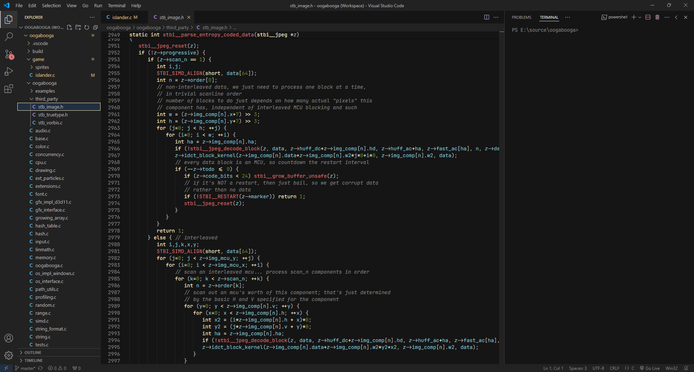

# theme-nickel

This is my custom theme I originally build for 4coder.  
You can find its source on [github](https://github.com/nickel-dev/theme-nickel).  
It's made to be consistent, niceon the eye and for every token to be distinct so you can be as efficient as possible.    

    

*Nickel.*